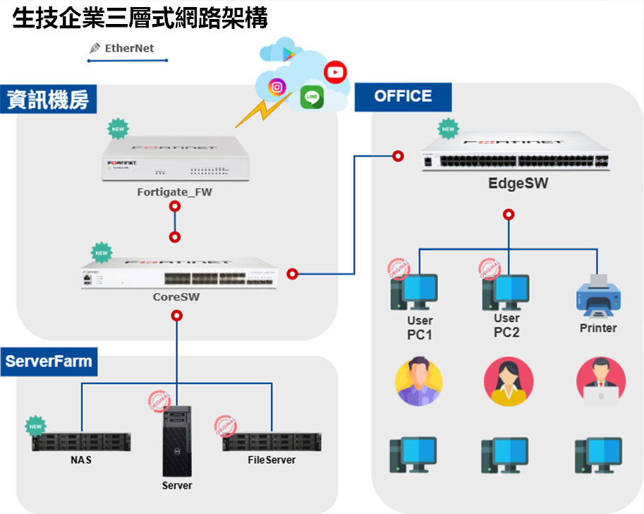

本案是生技企業邁向 IPO 前的第一階段 IT 基礎建設規劃。目標是採購設備以及建立一套符合內稽內控方向、具備資安防護、資料備援與擴充彈性的地雲混合架構。

規劃範圍同時涵蓋地端網路、Microsoft 365 雲端身分、端點設備管理及 Synology 備份，讓不同系統使用一致的帳號、安全政策與管理方式。

## 專案摘要

| 項目 | 內容 |
|---|---|
| 專案類型 | IPO 前期網路與系統基礎建設規劃 |
| 地端核心 | FortiGate、防火牆政策、核心與存取交換器、VLAN |
| 雲端服務 | Microsoft 365、Entra ID、MFA、Intune |
| 資料保護 | Synology NAS、Active Backup for Business、NAS 間備份 |
| 管理方向 | 統一身分、端點合規、集中管理、零信任存取 |
| 專案階段 | 架構與導入計畫完成，依階段執行建置與驗證 |

## 背景與需求

企業準備進入 IPO 階段後，IT 環境須要具備可管理、可追蹤與可驗證的控制機制。原本分散的帳號、端點設定、網路設備及備份方式，要重新整理成一致的管理架構。

這次規劃面對的核心問題包括：

- 網路邊界需要更完整的威脅防護與集中管理。
- 辦公區、伺服器區與重要設備需要透過 VLAN 進行分區隔離。
- 使用者身分與公司設備需要具備 MFA、合規性及存取控制。
- PC、實體伺服器、虛擬機與檔案資料需要可驗證的備份及還原機制。
- 架構須要能隨人員、辦公空間與資料量成長而擴充。

## 四項核心目標

### 強化網路邊界安全

導入 Fortinet 整合式資安架構，將防火牆、交換器與無線網路納入一致的管理範圍，並使用防毒、網頁過濾、應用程式控管等 UTM 功能降低外部威脅。

### 落實資料保護與備援

以新購 Synology NAS 搭配既有 NAS，規劃集中備份、自動同步、排程與還原測試，讓備份不只存在，也能確認資料可以實際復原。

### 建立雲端身分與存取管理

使用 Entra ID 作為主要身分平台，讓 Windows、電子郵件與雲端資源使用同一組公司帳號，並強制使用 MFA，降低帳號遭竊後直接存取企業資源的風險。

### 現代化端點管理

透過 Intune 納管公司電腦，統一派發 Windows 更新、Defender、防火牆、BitLocker、應用程式及連線設定。即使設備不在公司內網，仍能持續套用合規政策。

## 規劃後的地雲混合架構

地端網路以 FortiGate 作為 Internet 出口與安全控制核心，下接核心交換器，再分別連接辦公區存取交換器與 Server Farm。辦公區包含使用者電腦與印表機；伺服器區則集中 NAS、伺服器及檔案服務。

雲端部分以 Microsoft 365、Entra ID 與 Intune 建立身分和設備管理平面。遠端 VPN 可進一步透過 SAML SSO 與 Entra ID 整合，讓員工使用公司帳號與 MFA 安全連回內部資源。

## 網路安全與分層設計

- FortiGate 提供 Internet 邊界防護、VPN、UTM 與安全政策。
- 核心交換器承擔網路匯聚，辦公區由 Edge Switch 提供終端接取。
- 以 VLAN 區隔 Server Farm、使用者電腦及其他設備，降低不同安全區域互相影響。
- 防火牆、交換器與 AP 由單一管理介面集中監控，減少多套管理工具造成的維運負擔。
- 未來擴編或搬遷時，可延伸交換器及 AP，同時沿用既有的網路與資安政策。

## Microsoft 365 身分與端點管理

### Entra ID 與 MFA

員工使用同一組 Microsoft 365 帳號登入 Windows、電子郵件及雲端資源。MFA 作為第二層驗證，避免密碼外洩後帳號立即被冒用。

### Intune 合規性政策

規劃的端點控制包含：

- 強制 Windows 更新與必要的安全基線。
- 啟用 Microsoft Defender 與裝置防護設定。
- 要求 BitLocker 硬碟加密，降低遺失設備造成的資料外洩。
- 自動派發公司應用程式、Wi-Fi、VPN 與其他設定檔。
- 讓新進人員的電腦能以標準流程完成註冊與配置。

## Synology 備份與還原規劃

Synology Active Backup for Business 可集中備份公司 PC、實體伺服器與虛擬機，並降低依設備數量額外購買備份授權的成本。

本案規劃的資料保護方式包括：

- 新 NAS 完成硬碟、RAID、容量與保留政策規劃。
- 重要電腦、伺服器與虛擬機納入集中備份。
- 新舊 NAS 之間建立自動同步或備份排程。
- 透過實際還原測試確認備份可用，而非只檢查工作是否成功。
- 視 NAS 型號與支援條件評估 Entra ID 整合，減少重複帳密管理。

## 導入與建置階段

### 1. 網路基礎建設

- 上架防火牆、核心交換器與存取交換器。
- 建立 VLAN、Server Farm 與辦公區隔離。
- 配置基礎防火牆政策並驗證跨區及對外連線。

### 2. 儲存與備份

- 上架 Synology NAS 並完成 RAID 設定。
- 建立備份、NAS 間同步與排程。
- 執行還原測試並留下驗證紀錄。

### 3. 雲端身分與 Intune

- 建立 Microsoft 365 租用戶與 Entra ID 帳號。
- 設定 Intune 註冊條件、合規政策與設定檔。
- 建立 BitLocker、密碼、安全性及應用程式派發規則。

### 4. 端點導入與交付

- 先將既有三台 PC 加入 Entra ID 並註冊 Intune。
- 驗證端點政策、內部網路與 NAS 存取。
- 交付管理員文件、系統權限與後續維運方式。

## 規劃成果

- 完成 IPO 第一階段 IT 基礎架構藍圖。
- 將網路安全、雲端身分、端點管理與資料備份整合為同一套導入計畫。
- 建立可分階段執行的設備上架、政策配置、驗證及交付流程。
- 將備份還原、MFA、磁碟加密及設備合規納入控制要求。
- 保留人員、設備、辦公空間及資料量成長時的擴充彈性。

## 我的職責

- 釐清 IPO 前期的網路、身分、端點與資料保護需求。
- 規劃 Fortinet 網路安全與 VLAN 分層架構。
- 規劃 Microsoft 365、Entra ID、MFA 與 Intune 導入方式。
- 規劃 Synology NAS、Active Backup for Business 與還原驗證流程。
- 整理設備服務、導入階段、驗證項目與交付內容。
