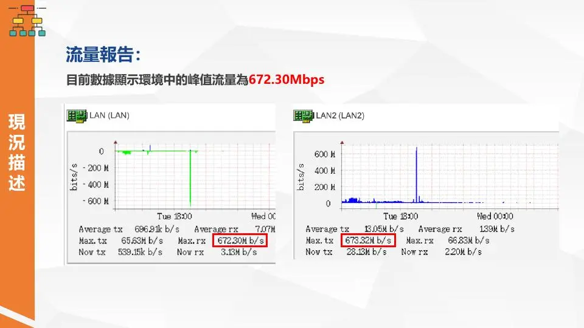
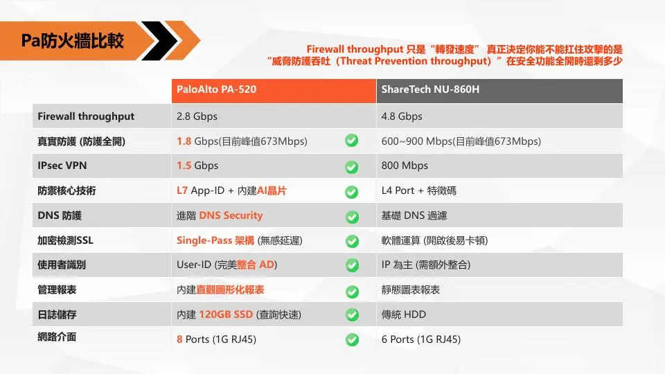
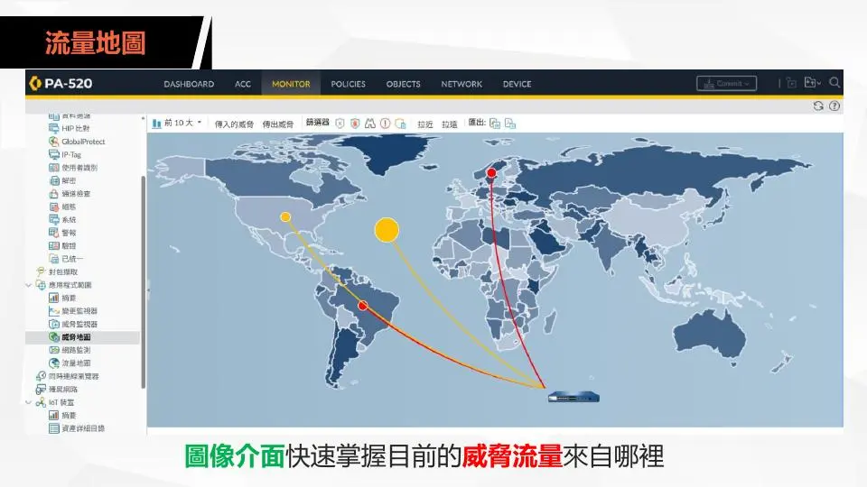
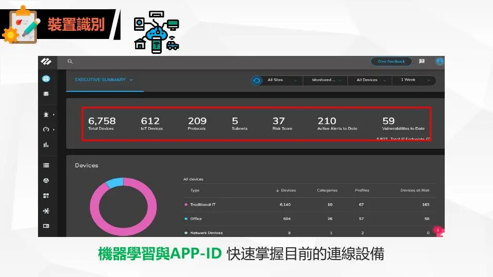

本案針對企業既有防火牆進行汰換評估。使用者反映目前的 Log 與報表難以直接判斷異常流量來源，同時希望提升邊界防護能力，因此以現有流量、完整安全功能開啟後的效能，以及管理可視性作為主要評估依據。

規劃方向是將既有 ShareTech NU-860H 汰換為 Palo Alto PA-520，從傳統以 IP、Port 為主的控管方式，提升到可辨識應用程式、使用者、裝置與威脅行為的次世代防火牆架構。本頁記錄的是現況分析與汰換提案，並非已完成的正式切換成果。

## 專案摘要

| 項目 | 內容 |
|---|---|
| 專案類型 | 次世代防火牆汰換與資安可視化規劃 |
| 既有設備 | ShareTech NU-860H |
| 規劃設備 | Palo Alto PA-520 |
| 流量基線 | 量測峰值約 672.30 Mbps |
| 核心需求 | 異常流量判讀、L7 應用識別、威脅防護與直覺化報表 |
| 專案階段 | 現況盤點、效能比較與汰換方案完成，尚待正式導入驗證 |

## 現況與使用者回饋

既有防火牆可提供基本網路控管，但使用者在查看 Log 時，難以快速確認流量是由哪一個應用程式、裝置或威脅行為產生。發生異常時仍需要逐筆比對 IP 與 Port，增加分析時間與維運負擔。

本案整理出的兩項主要需求為：

- 報表須能直接呈現應用程式、威脅來源與裝置資訊。
- 完整安全功能開啟後，設備仍須承受目前及未來成長的流量。

## 流量基線與效能需求

現況報告顯示峰值流量約為 672.30 Mbps。設備評估不能只看 Firewall Throughput，還需要比較啟用 IPS、防毒、應用識別與威脅防護後剩餘的 Threat Prevention Throughput，才能反映實際營運時的安全效能。

提案資料中的主要比較數據如下：

| 評估項目 | Palo Alto PA-520 | ShareTech NU-860H |
|---|---:|---:|
| Firewall Throughput | 2.8 Gbps | 4.8 Gbps |
| 完整防護效能 | 1.8 Gbps | 600–900 Mbps |
| IPsec VPN | 1.5 Gbps | 800 Mbps |
| 網路介面 | 8 × 1G RJ45 | 6 × 1G RJ45 |

## 防火牆能力差異

### 從 L4 控管提升到 L7 識別

傳統 L4 防火牆主要依照來源、目的 IP、Port 與通訊協定判斷流量。現代應用經常共用 80、443 等連接埠，單純依靠 Port 難以分辨實際使用的服務。

Palo Alto App-ID 會進一步辨識流量所屬應用程式，讓管理者可以針對軟體與行為制定政策，而不是只允許或封鎖一個連接埠。

### 威脅防護與未知流量分析

規劃中的次世代防護包含惡意程式、入侵行為、C2 連線、惡意網站與未知威脅分析。透過全球威脅情資及機器學習輔助判斷，降低只依靠固定特徵碼而無法即時辨識新型攻擊的限制。

### 加密流量與單次掃描架構

企業大部分網路服務已使用 TLS 加密。評估設備時，需要同時考量 SSL 解密、安全掃描與應用識別開啟後的效能，而不是只比較未啟用安全功能時的封包轉送數字。

## 管理與威脅可視化

### 威脅流量地圖

圖形化威脅地圖可快速呈現異常連線的來源與目的地，讓管理者不需要先逐筆閱讀原始 Log，即可掌握事件分布，再進一步調查相關應用、使用者與連線紀錄。

### App-ID 與裝置識別

App-ID 用於辨識實際應用程式；裝置識別則協助盤點目前連線的電腦、行動裝置、網通及其他終端。兩者結合後，可以把安全政策從單純的 IP 控管，提升為依照使用者、裝置及應用情境進行管理。

### 使用者與報表介面

- 以圖形化報表呈現流量、應用程式與威脅事件。
- 透過 User-ID 與既有目錄服務整合，將連線行為對應至實際使用者。
- 支援多國語系管理介面，降低日常維運與交接門檻。
- 使用內建儲存空間保留日誌，提升事件查詢與追蹤效率。

## 汰換方案

本次方案規劃導入一台 Palo Alto PA-520，取代既有 ShareTech NU-860H，並重新整理 Internet 邊界政策、應用程式識別、威脅防護及日誌報表。

正式導入階段預計包含：

1. 備份既有防火牆設定，整理介面、路由、NAT、政策與 VPN。
2. 將既有規則轉換為可辨識應用程式與使用者的 L7 政策。
3. 啟用威脅防護、DNS 安全、SSL 檢測與日誌功能後進行效能驗證。
4. 驗證 Internet、內部服務、VPN 與主要應用程式連線。
5. 建立切換失敗時的回復條件與既有設備還原流程。

## 預期改善

- 完整安全功能開啟後仍保留相對充足的效能空間。
- 從 IP 與 Port 紀錄提升到應用程式、使用者及裝置層級的可視性。
- 透過圖形化介面快速掌握異常流量與威脅來源。
- 加強未知惡意程式、C2 連線與新型態攻擊的偵測能力。
- 降低人工逐筆查閱 Log 的時間與判讀難度。

## 我的職責

- 彙整使用者對 Log 判讀與防護能力的實際需求。
- 分析既有環境流量報告並建立 672.30 Mbps 峰值基線。
- 比較 ShareTech NU-860H 與 Palo Alto PA-520 的效能及安全能力。
- 說明 L4、L7、App-ID、威脅情資與機器學習防護的差異。
- 規劃防火牆汰換範圍、政策轉換、驗證項目與回復流程。
- 整理提案簡報，將技術差異轉化為使用者可理解的改善效益。
