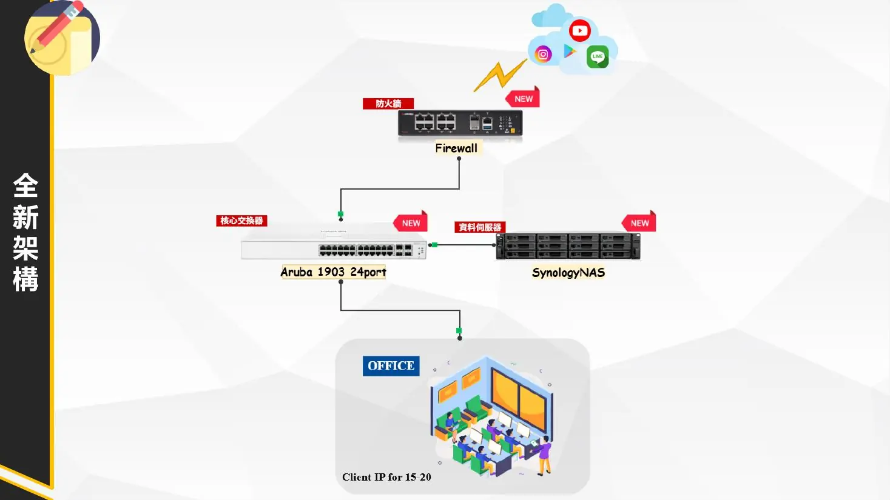

本案針對餐飲企業既有辦公網路進行改善規劃。原環境沒有部署企業級防火牆與區域網路隔離，使用者透過 Hub 及電信數據機直接連上 Internet，內部設備、營運資料與對外連線都缺乏完整的安全及管理機制。

規劃核心不是單純增加設備，而是同時解決邊界防護、網路效能、連接埠擴充與資料備份問題，建立可以支援後續人員、設備及服務成長的基礎架構。

## 專案摘要

| 項目 | 內容 |
|---|---|
| 專案類型 | 企業網路安全與集中儲存改善規劃 |
| 原始架構 | 使用者、Hub、電信數據機與 Internet 直接串接 |
| 核心設備 | 次世代防火牆、Aruba Instant On 1930、Synology NAS |
| 改善重點 | 邊界防護、L7 應用控管、流量穩定、集中儲存與自動備份 |
| 擴充方向 | VPN、QoS、10G 上行、權限管理與錄影儲存 |
| 專案階段 | 現況盤點、風險分析與新架構規劃完成 |

## 現況與問題背景

原有網路由電信數據機與 Hub 承擔對外連線及內部資料轉發。這種架構雖然能提供基本連線，但缺少企業網路需要的安全檢查、流量管理及集中監控能力。

當使用人數、資料量或網路服務增加後，既有設備不只容易成為效能瓶頸，也會讓所有內部終端直接暴露在外部威脅之下。公司檔案則分散在不同使用者電腦，沒有一致的權限、備份及版本復原方式。

## 影響營運的三項主要風險

### 缺乏網路邊界防護

原環境沒有企業級防火牆，無法有效檢查惡意封包、阻擋入侵或辨識高風險應用。如果遭遇惡意掃描、勒索軟體或帳號遭濫用，威脅可能直接進入內部網路並影響多台設備。

### 核心設備效能不足

內外部流量集中由家用級電信設備及 Hub 處理。當多人同時下載大型檔案、觀看高畫質影音或執行備份時，可能發生碰撞、重傳、封包遺失及連線不穩，進而影響營運效率。

### 資料分散且缺少備份

重要文件與專案資料散落在個人電腦，缺少集中儲存及自動備份。若終端硬碟損壞、電腦中毒、檔案誤刪或人員異動，可能造成資料無法復原與交接困難。

## 規劃後的網路架構

新架構由次世代防火牆負責 Internet 邊界防護，下接 Aruba Instant On 1930 核心交換器，再分別連接辦公室使用者與 Synology NAS。各設備角色清楚分工，避免所有功能集中在電信數據機上。

資料流量先經過防火牆檢查，再由核心交換器完成內部高速轉發；公司文件、備份與監控錄影則集中存放於 NAS，形成安全、效能與資料保護三個層次。

## 次世代防火牆規劃

### 外部威脅防禦

防火牆作為企業網路第一道安全防線，檢查來自 Internet 的連線與封包，搭配 IPS、防毒及威脅防護功能，降低駭客入侵及勒索軟體進入內部網路的風險。

### L7 應用程式辨識

傳統防火牆主要依照 IP 與 Port 進行判斷，但現代應用可能共用相同連接埠。次世代防火牆可透過深度封包檢測辨識實際應用，針對 P2P、影音串流、翻牆工具或其他高風險流量套用不同政策。

### 內容與行為控管

依照公司政策限制非工作相關網站及高耗頻寬應用，並可進一步控制應用程式內的特定行為，例如允許使用網頁信箱，但限制上傳附件，降低資料外洩風險。

### 安全遠端連線

保留 VPN 導入能力，讓員工未來在外出差或遠端工作時，可以透過加密通道安全連回公司資源，不需要直接將內部服務暴露在 Internet。

## Aruba 1930 核心交換器規劃

### 取代 Hub 的共享與碰撞環境

企業級交換器會為每個連接埠提供獨立的傳輸路徑，避免 Hub 共享頻寬與碰撞網域造成的封包重傳。多台設備同時傳輸時，能維持較穩定的網路效能。

### 連接埠與未來擴充

24 個 Gigabit 連接埠可支援現有電腦與 NAS，也能保留新增印表機、IP Phone 或員工電腦的空間。4 組 10G 上行介面則為未來骨幹及儲存網路升級預留彈性。

### QoS 服務品質

透過 QoS 將視訊會議、營運系統或 NAS 備份等重要流量設定優先順序，避免單一使用者或設備大量占用頻寬，影響其他人的工作連線。

## Synology NAS 集中儲存規劃

### 集中檔案與共享

將公司文件與專案資料集中存放，讓不同部門依照權限共同存取，減少檔案散落在個人電腦及版本不一致的問題。

### 權限與資料隔離

可依部門及職務建立資料夾權限，例如限制財務、管理或敏感資料只有指定人員可以查看及修改，降低不必要的存取風險。

### 自動備份與版本復原

依排程將使用者電腦及重要資料備份到 NAS，並保留多個歷史版本。當檔案遭誤刪、覆蓋或受到惡意程式影響時，可回復到先前可用版本。

### 監控錄影儲存

NAS 同時可納入監控錄影的集中儲存規劃，依容量、保存天數與攝影機數量評估空間，避免錄影資料與一般文件混放而缺少管理。

## 規劃成果

- 完成現有網路、資安風險與資料保存問題的盤點。
- 將防火牆、核心交換器與 NAS 的角色拆分，建立清楚的設備分工。
- 規劃 Internet 邊界防護、L7 應用控管與未來 VPN 能力。
- 改善 Hub 共享頻寬、碰撞及設備擴充不足的問題。
- 建立集中檔案、權限控管、自動備份與版本復原方向。
- 保留 10G 骨幹、更多終端與後續服務擴充空間。

## 我的職責

- 盤點既有 Internet、Hub、使用者及資料儲存方式。
- 整理外部威脅、核心效能與資料遺失等營運風險。
- 規劃次世代防火牆的安全政策、內容控管及 VPN 用途。
- 規劃 Aruba Instant On 1930 的核心交換、QoS 與擴充方式。
- 規劃 Synology NAS 的檔案共享、權限、備份及版本復原用途。
- 整理改善架構與設備功能，形成可供後續建置執行的專案方案。
